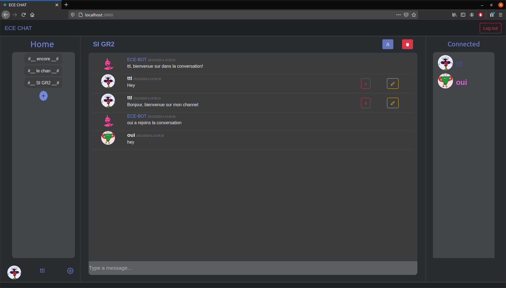

# CHAT-ECE

## Introduction :

#### Ce chat utilise des cookies, de ce fait, il ne fonctionne pas sur Google chrome en "localhost". Sa conception fut réalisée sous Firefox. Pour une utilisation optimale, ouvrez une fenêtre en navigation privée avec un autre utilisateur afin de communiquer.


## Initialisation du projet :
- Installer les dépendances du frontend :
  ```
  cd front-end && npm i && cd ..
  ```
- Installer les dépendances du backend : 
  ```
  cd backend && npm i
  ```

- Nous avons utilisé le packet concurrently afin de lancer le backend et le frontend avec une seule commande:\
(Voir scripts package.json backend)

  ```
  "client": "npm run start --prefix ../front-end",
  "dev": "concurrently \"npm run start\" \"npm run client\""
  ```
- Pour run le projet, dans le fichier backend faire la commande suivante:

  ```
    npm run dev
  ```
  Votre chat vous attendra sur http://localhost:3000, il communique avec un backend situé sur le port 5000. \
  Nous avons decidé de nous inspirer du célèbre chat `Discord`.

  Il existe des comptes déjà existant :
  - Pseudo : tiago, Password : tiago
  - Pseudo : lucas, Password : lucas

## Description : 

### 1.  Backend :

Pour la base de données, ce chat utilise `levelDB` et communique avec un serveur `express`.
Les routes de ce chat se situent dans les fichiers route.js.

Afin d'améliorer l'application nous avons utilisé une librairie permettant de gérer le système en temps réel, `Socket.io`.

### 2.  Frontend :

Notre application est développée en `ReactJS`, et nous avons utilisé `react-bootstrap` en complement.  

### 3.  Fonctionalités :

#### a. Connexion et création de compte : 

Un utilisateur peut se créer un compte avec les informations suivantes :

- email
- pseudo
- password

Un utilisateur ne peut utiliser un pseudo déjà pris par un autre, de même pour l'email.\
Après la création de son compte, il peut se connecter avec son pseudo et mot de passe.

#### b. Ecran de bienvenue :

Une fois connecté l'utilisateur retrouve toutes les informations pertinentes sur la page d'accueil. 

#### c. Création de channels : 

Un utilisateur peut créer des channels, il en devient alors l'administrateur, il sera la seule a pouvoir ajouter des utilisateurs ou bien supprimer le channel.
Un utilisateur pourra donc retrouver ses propres channels ainsi que ceux ou il fut ajouté.

#### d.  Ajout d'utlisateur à un channel :

L'administrateur peut ajouter des membres à son channel uniquement si l'utilisateur possède un compte ECE CHAT et qu'il ne soit pas déjà dans le channel. 

#### e. Messages :

Les messages sont restreints aux channels dans lesquels ils ont été envoyer. 
Un utilisateur peut envoyer un message, supprimer ses messages ou bien les modifier. 

#### f. Avatar :

L'avatar de l'utilisateur est associé à son email en utilisant gravatar. Si celui-ci ne possède pas de gravatar, alors un avatar aléatoire sera généré. L'utilisateur peut par la suite modifier son avatar dans les préférence de compte.

#### g.  Préférence de compte :

L'utilisateur retrouve dans les réglages ses informations personnelles, et il a la possibilité s'il le souhaite de changer d'avatar parmi 6 propositions. 

#### h.  Channels :

Un bot est présent sur les différents channels pour accueillir les utilisateurs, de plus une liste des utilisateurs connecté aux channels est indiqué.

##  Quelques images :


Register | Login
- | - 
 | 

Channel
- 

Settings
-


## Informations:

Si vous rencontrez un problème, n'hésitez pas à nous contacter aux adresses suivantes :
- tiago.teixeira-lopes@edu.ece.fr
- lucas.farcy@edu.ece.fr
